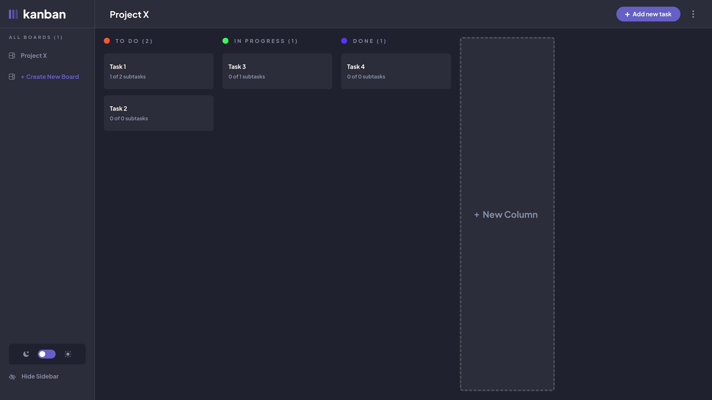

# Kanban Task Management Application with User Authentication

This is a Kanban task management application developed to help users organize their projects and tasks efficiently. Below, you'll find information about the tools used for implementation and the features of the application.

## Tools Used

### Frontend

- **React**: Utilized as the frontend framework to build the user interface.
- **Redux Toolkit**: Employed for state management, offering a predictable state container.
- **React Redux**: Integrated for connecting React components with the Redux store.
- **@uidotdev/usehooks**: A library for custom React hooks, enhancing code reusability and readability.
- **Tailwind CSS**: Utilized for styling components, providing utility-first CSS.

### Authentication and Database

- **Firebase**: Integrated for user authentication and account management, providing secure user authentication and real-time database functionalities.

### Development and Build Tools

- **Vite**: Used as the frontend build tool and development server, offering fast builds and instant hot module replacement.
- **TypeScript**: Employed for type-checking and adding static types to JavaScript code.
- **ESLint**: Utilized for code linting to ensure code quality and consistency.
- **Prettier**: Integrated for code formatting, maintaining a consistent code style across the project.

## Features

### Kanban Board

- **Multiple Columns**: Organize tasks into different stages such as "To Do," "In Progress," and "Done."
- **Drag and Drop**: Easily move tasks between columns using intuitive drag and drop functionality.

### Task Management

- **Task Creation**: Create new tasks with a name and description.
- **Task Editing**: Edit existing tasks to update their details.
- **Subtasks**: Add subtasks to break down tasks into smaller, manageable units.

### Project Management

- **Project Creation**: Create new projects to group related tasks together.
- **Project Selection**: Switch between different projects to manage tasks separately.

### User Authentication

- **Sign Up and Sign In**: Users can create accounts and sign in securely.
- **Authentication State**: Manage user authentication state in real-time.
- **Authorization**: Restrict access to certain features based on user authentication status.
- **Email Validation**: After signing up, users are required to validate their email address. A verification email is sent, and access to certain features is restricted until the email is verified.
- **Two-Factor Authentication (2FA)**: For enhanced security, users can enable 2FA. Once enabled, users must enter a 6-digit code generated by an authentication app (like Google Authenticator) to sign in.

### User Interface

- **Responsive Design**: Ensure compatibility and usability across various devices and screen sizes.
- **Dynamic Updates**: Automatically reflect changes in real-time without the need for manual refreshing.

## Installation

1. Clone the repository.
2. Install dependencies using `npm install`.
3. Run the development server with `npm run dev`.
4. Open the application in your browser at the specified address.

## Usage

1. **Sign Up and Email Verification**:
   - Create an account by signing up.
   - Check your email for a verification link. You must verify your email to access all features.
   - If you do not receive the email, you can request a new verification link.

2. **Enabling Two-Factor Authentication**:
   - After signing in, navigate to your profile settings.
   - Enable 2FA by scanning the QR code provided with your authentication app.
   - Enter the 6-digit code generated by the app to complete the setup.

3. **Using the Kanban Board**:
   - Create a new project or select an existing one.
   - Add tasks to the Kanban board.
   - Move tasks between columns as they progress.
   - Edit task details or mark them as complete.
   - Enjoy organized project management with ease!

## Contribution

Contributions are welcome! Feel free to open issues or pull requests for any enhancements or bug fixes.

## License

This project is licensed under the [MIT License](LICENSE).
